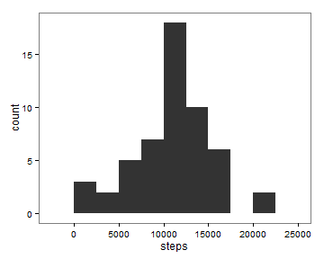
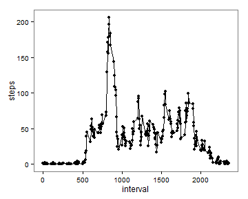
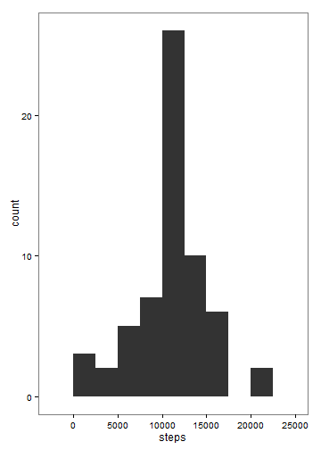
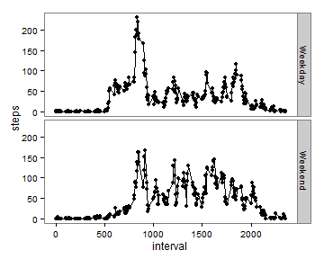

This document is for the first assignment of the Reproducible Research Course, which is a report for the analysis of a *personal activity monitoring device* dataset. The dataset is downloaded from <https://d396qusza40orc.cloudfront.net/repdata%2Fdata%2Factivity.zip>. The original dataset contains three variables.

* **steps**: Number of steps taking in a 5-minute interval (missing values are coded as `NA`)

* **date**: The date on which the measurement was taken in YYYY-MM-DD format

* **interval**: Identifier for the 5-minute interval in which measurement was taken

The goal of this analysis is to understand the pattern of **steps** in regard to **date** and **interval**. The analysis steps/questions are as follows.

1. Loading and preprocessing the data.
2. What is mean total number of steps taken per day?
3. What is the average daily activity pattern?
4. Imputing missing values.
5. Are there differences in activity patterns between weekdays and weekends?

## Loading and preprocessing the data

1. Downloaded data and unzip the zip file, resulting a csv file.

```r
URL <- "http://d396qusza40orc.cloudfront.net/repdata%2Fdata%2Factivity.zip"
Folder <- "C:/Users/Yu-Chen Wang/Box Sync/R/Coursera/RepData_PeerAssessment1/"
download.file(url = URL, destfile = paste0(Folder, "Activity_monitoring_data.zip"), method="auto")
unzip(paste0(Folder, "Activity_monitoring_data.zip"))
```

2. Loaded the csv file.

I used `read.csv` to load the dataset and save it to the `activity` variable.

```r
activity <- read.csv(paste0(Folder, "activity.csv"))
```

3. Explored the `activity` dataset.

I applied these following functions to have a basic understanding of the dataset.

```r
dim(activity) # Report the dimension of the dataset.
```

```
## [1] 17568     3
```


```r
head(activity) # Report the first 6 rows of the dataset.
```

```
##   steps       date interval
## 1    NA 2012-10-01        0
## 2    NA 2012-10-01        5
## 3    NA 2012-10-01       10
## 4    NA 2012-10-01       15
## 5    NA 2012-10-01       20
## 6    NA 2012-10-01       25
```


```r
tail(activity) # Report the last 6 rows of the dataset.
```

```
##       steps       date interval
## 17563    NA 2012-11-30     2330
## 17564    NA 2012-11-30     2335
## 17565    NA 2012-11-30     2340
## 17566    NA 2012-11-30     2345
## 17567    NA 2012-11-30     2350
## 17568    NA 2012-11-30     2355
```


```r
str(activity) # Report the structure and characteristics the dataset.
```

```
## 'data.frame':	17568 obs. of  3 variables:
##  $ steps   : int  NA NA NA NA NA NA NA NA NA NA ...
##  $ date    : Factor w/ 61 levels "2012-10-01","2012-10-02",..: 1 1 1 1 1 1 1 1 1 1 ...
##  $ interval: int  0 5 10 15 20 25 30 35 40 45 ...
```

The **date** column is in `factor`. I changed it to be in `Date` class.

```r
activity$date <- as.Date(activity$date)
```

## What is mean total number of steps taken per day?

1. Created a new dataset `activity_NA0` that contain all the non-NA value in the 'activity' dataset.


```r
activity_NA0 <- subset(activity, !is.na(steps) == TRUE)
```

2. Calculated the total number of `steps` taken per day.


```r
Sum_steps <- tapply(activity_NA0$steps, activity_NA0$date, sum) 
# This line calculated the sum of steps for each date.

Sum_steps_df <- data.frame(date = names(Sum_steps), steps = Sum_steps, 
                           row.names = NULL)
# Transformed the result into a data frame.

Sum_steps_df$steps <- as.numeric(Sum_steps_df$steps)
# Made the steps column to be in numeric class.
```

3. Made a histogram of the total number of `steps` taken each day. I used ggplot2 to creat the histogram.

```r
if(!require("ggplot2")){install.packages("ggplot2"); require("ggplot2")}
# Loaded the ggplot2 package. If it is not installed yet, install ggplot2.
```
 

```r
ggplot(data = Sum_steps_df, aes(x = steps)) +
        geom_histogram(binwidth = 2500) +
        theme_bw() +
        theme(panel.grid.major = element_blank(), panel.grid.minor = element_blank())
```

 

4. Calculated and reported the mean and median of the total number of `steps` taken per day.


```r
Sum_steps_mean <- mean(Sum_steps_df$steps)
Sum_steps_median <- median(Sum_steps_df$steps)
```

The mean is **10766.19**. The median is **10765**. 

## What is the average daily activity pattern?

1. Calculated the mean of each `interval`.

```r
Interval_steps <- tapply(activity_NA0$steps, activity_NA0$interval, mean) 
# Calculated the mean.

Interval_steps_df <- data.frame(interval = names(Interval_steps), steps = Interval_steps)
# Transformed the result into a data frame. 

Interval_steps_df$interval <- as.numeric(as.character(Interval_steps_df$interval))
Interval_steps_df$steps <- as.numeric(Interval_steps_df$steps)
# These two lines made interval and steps to be in numeric class.
```

2. Created the time series plot.

```r
ggplot(Interval_steps_df, aes(x = interval, y = steps)) +
        geom_line() +
        geom_point() +
        theme_bw() +
        theme(panel.grid.major = element_blank(), panel.grid.minor = element_blank())
```

 

3. Found the interval with the maximum value of mean.

```r
Interval_Max <- Interval_steps_df[which.max(Interval_steps_df$steps),1]
```

The interval with the maximum value of mean is **835**.

## Imputing missing values

1. Calculated and reported the total number of missing values in the dataset.


```r
NA_Number <- apply(activity, 2, function(x) sum(is.na(x)))
```

The total number of missing values in `steps` is **2304**.

2. Devised a strategy for filling in all of the missing values in the dataset.

I decided to use the mean of that interval to fill in the missing value, so created a new data frame called `activity_New`. After that, I applied a for loop to fill in the 'NA'. 


```r
activity_New <- activity 

for (i in 1:dim(activity)[1]){
        if (is.na(activity[i,1]) == TRUE){
                activity_New[i,1] <- Interval_steps_df[match(activity[i,3], Interval_steps_df[,1]),2]
        }
}
```

3. Calculated the total number of 'steps' taken per day.


```r
Sum_steps_New <- tapply(activity_New$steps, activity_New$date, sum)
Sum_steps_New_df <- data.frame(date = names(Sum_steps_New), steps = Sum_steps_New, 
                               row.names = NULL)

Sum_steps_New_df$steps <- as.numeric(Sum_steps_New_df$steps)
```


4. Created the histogram of `steps`.


```r
ggplot(data = Sum_steps_New_df, aes(x = steps)) +
        geom_histogram(binwidth = 2500) +
        theme_bw() +
        theme(panel.grid.major = element_blank(), panel.grid.minor = element_blank())
```

 

5. Calculated mean and median


```r
Sum_steps_New_mean <- mean(Sum_steps_New_df$steps)
Sum_steps_New_median <- median(Sum_steps_New_df$steps)
```

The mean is **10766.19**. The median is **10766.19**.

6. Do these values differ from the estimates from the first part of the assignment? What is the impact of imputing missing data on the estimates of the total daily number of steps?

Both the mean and median are the same or almost the same as the mean and median in the first part of the assignment. It seems like after replacing the `NA` with the mean value of the same `interval`, more 'interval' groups have a value of 'steps' that fall within the range between **10000** to **12500**, which covers the mean (**10766.19**) and median (**10766.19**).


## Are there differences in activity patterns between weekdays and weekends?

1. Labeled weekday and weekend.


```r
activity_New$day <- weekdays(activity_New$date)

activity_New$day[activity_New$day == "Monday"] <- "Weekday"
activity_New$day[activity_New$day == "Tuesday"] <- "Weekday"
activity_New$day[activity_New$day == "Wednesday"] <- "Weekday"
activity_New$day[activity_New$day == "Thursday"] <- "Weekday"
activity_New$day[activity_New$day == "Friday"] <- "Weekday"
activity_New$day[activity_New$day == "Saturday"] <- "Weekend"
activity_New$day[activity_New$day == "Sunday"] <- "Weekend"
# These lines changed "Monday", "Tuesday", "Wednesday", "Thursday", and "Friday" to be "Weekday", while "Saturday" and "Sunday" to be "Weekend".

activity_New$day <- as.factor(activity_New$day)
```

2. Calculated the mean.


```r
activity_New_Weekday <- subset(activity_New, day == "Weekday")
activity_New_Weekend <- subset(activity_New, day == "Weekend")
# Subset the data drame based on "Weekday" or "Weekend".

Interval_steps_Weekday <- tapply(activity_New_Weekday$steps, activity_New_Weekday$interval, mean)
Interval_steps_Weekday_df <- data.frame(interval = names(Interval_steps_Weekday), 
                                        steps = Interval_steps_Weekday, 
                                        day = rep("Weekday", dim(Interval_steps_Weekday)))

Interval_steps_Weekend <- tapply(activity_New_Weekend$steps, activity_New_Weekend$interval, mean)
Interval_steps_Weekend_df <- data.frame(interval = names(Interval_steps_Weekend), 
                                        steps = Interval_steps_Weekend,
                                        day = rep("Weekend", dim(Interval_steps_Weekend)))

Interval_steps_New_df <- rbind(Interval_steps_Weekday_df, Interval_steps_Weekend_df )
# Combined the resulting data frames to be one data frame

Interval_steps_New_df$interval <- as.numeric(as.character(Interval_steps_New_df$interval))
Interval_steps_New_df$steps <- as.numeric(Interval_steps_New_df$steps)
```


3. Created the time series plot.


```r
ggplot(Interval_steps_New_df, aes(x = interval, y = steps)) +
        geom_line() +
        geom_point() +
        facet_grid(day ~.,) +
        theme_bw() +
        theme(panel.grid.major = element_blank(), panel.grid.minor = element_blank())
```

 

